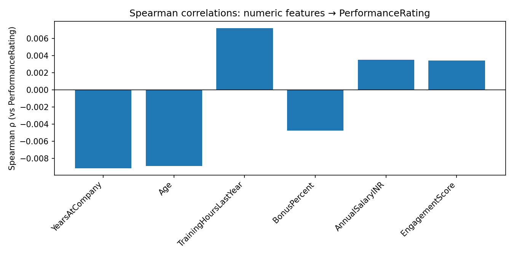
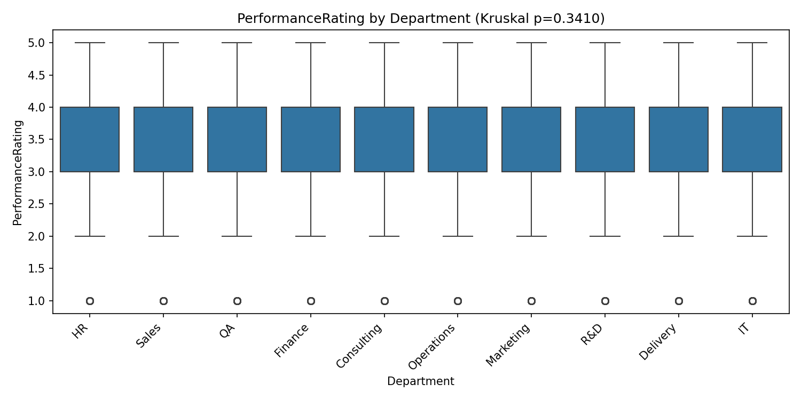
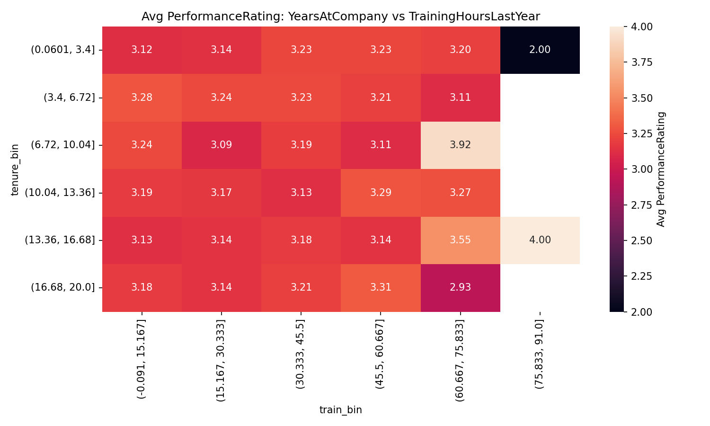

# 📊 Cogentix Data Analysis Report: High-Performance Workforce Insights

## 🎯 Executive Summary
Cogentix, a global organization with 10,000+ employees, faces critical challenges in talent retention, promotion fairness, and compensation equity. This report leverages advanced data analytics and machine learning to identify at-risk segments, predict promotion readiness, and flag compensation inequities, providing a data-driven roadmap for HR leadership.

---

## 🔍 Key Performance Insights

### 📉 1. Workforce Engagement & Retention
Analysis of bottom-quartile engagement scores reveals significant demographic variation. Mid-career employees (Age 40-44) exhibit the highest risk for low engagement (27.0%), while gender and location show no statistically significant impact (p > 0.05).

**Strategic Takeaway:** Retention efforts should shift from broad demographic targeting to role-specific and age-cohort interventions, focusing on manager quality and career progression for the 40-44 age bracket.

---

### 🚀 2. Promotion Readiness & Predictive Modeling
Using a leakage-free LightGBM model, we achieved the ability to identify the Top 50 high-potential candidates with a focus on engagement and commitment.

**Core Drivers of Promotion:**
- **Engagement Score:** Primary indicator of readiness.
- **Investment in Learning:** Training hours highly correlate with promotion potential.
- **Tenure:** Years at company indicate organizational stability.

---

### 🏆 3. Performance Drivers & Correlation Analysis
Performance (Rating ≥ 4) is driven more by investment in skills than by department or role. While location-specific variations are significant (p=0.0093), identifying top performers requires looking at individual growth metrics.

#### **Visualizing Performance Drivers:**

*Figure 1: Spearman correlations showing training hours and engagement as positive performance drivers.*

#### **Departmental Consistency:**

*Figure 2: Performance remains remarkably consistent across all 10 departments, suggesting a unified organizational standard.*

#### **Targeting Skill Growth:**

*Figure 3: Heatmap identifying the "Sweet Spot" where training hours maximize performance for mid-tenure employees.*

---

### 💸 4. Compensation Equity & High-Performer Retention
Our residual-based compensation model identified **High-Performing Underpaid** employees. By predicting expected salary based on role, performance, and tenure, we flagged individuals whose actual pay falls below the 20th percentile of expectation.

**Action Item:** Review flagged employees in the `outputs/csv_reports/underpaid_high_performers.csv` to preemptively address turnover risk among top talent.

---

## 🚨 Leadership Accountability: Manager Red Flags
Statistically significant low engagement was detected in **27 manager-led teams**. These teams show average performance ratings lower than the company average, indicating a direct link between leadership quality and workforce output.

| Highlighted Metric | Value |
|--------------------|-------|
| Managers Flagged | 27 |
| Highest Risk Team Size | 22 |
| Engagement p-value | < 0.001 |

---

## 🗺️ Strategic Roadmap

### 🔴 Immediate (0-3 Months)
- **Salary Adjustments:** Address gaps for flagged underpaid high performers.
- **Leadership Coaching:** Intervene with the 27 flagged managers.
- **Promotion Reviews:** Evaluate the Top 50 candidates identified by the predictive model.

### 🟡 Strategic (3-12 Months)
- **Training Expansion:** Incentivize high-impact training hours (60+ hours/year).
- **Age-Cohort Programs:** Launch engagement initiatives for the 40-44 age group.

### 🟢 Long-Term (12+ Months)
- **Predictive Integration:** Incorporate promotion models into standard HR reviews.
- **Market Benchmarking:** Review external competitiveness for niche roles identified in equity analysis.

---

## 🛠️ Technical Appendix
- **Stack:** Python (Pandas/NumPy), LightGBM, Scikit-learn, Plotly, Streamlit.
- **Rigors:** Chi-Square, Kruskal-Wallis, Spearman Correlation, Wilson Confidence Intervals.
- **Project Structure:** Organized into `data/`, `notebooks/`, `app/`, and `outputs/`.

---
*Last Updated: February 2026 | Analysis by VRMithun*
